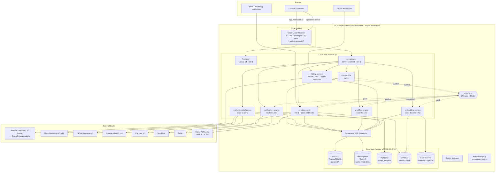

# Vertex CRM — Operations Deployment Runbook

> **Audience:** Operations team. **Goal:** bring Vertex CRM live in our GCP space tomorrow.
> **Version 1.0.1** · **Status:** peer-reviewed; 9/9 database migrations verified live on PostgreSQL 16; all source files parse clean; defects VR-01–VR-13 fixed (register in `docs/ARCHITECTURE-TOGAF.md`).
>
> **v1.0.1 adds (GAP-01…05):** Meta token lifecycle (long-lived exchange, expiry sweep, needs-reauth alerts) · WhatsApp media archiving to tenant GCS · WhatsApp quality/tier monitoring (webhook + daily poll) · conversation export (CSV/JSON + signed media URLs) · WhatsApp chat-history import (official "Export chat" .txt, preview→commit→undo) · gateway routing fixes (crm /api/v1 rewrites, webhook prefix auth-bypass, agent route alignment).

---

## 1. System Diagram



---

## 2. Complete Dependency Manifest

### 2.1 GCP APIs (enable before anything else)

```bash
gcloud services enable run.googleapis.com sqladmin.googleapis.com \
  redis.googleapis.com pubsub.googleapis.com artifactregistry.googleapis.com \
  secretmanager.googleapis.com storage.googleapis.com aiplatform.googleapis.com \
  bigquery.googleapis.com vpcaccess.googleapis.com cloudbuild.googleapis.com \
  compute.googleapis.com iam.googleapis.com firebase.googleapis.com
```

### 2.2 Infrastructure resources (created by `terraform apply`)

| Resource | Spec (production) | Purpose |
|---|---|---|
| VPC `vertex-production-vpc` | 10.0.0.0/16 | Private network |
| Serverless VPC Connector | /28 range | Cloud Run → private data layer |
| Cloud NAT + Router | 1 | Outbound egress for connectors |
| Cloud SQL `vertex-crm-db` | PostgreSQL 15, db-custom-4-15360, 100 GB SSD, private IP, daily backups | System of record |
| Memorystore `vertex-redis` | Redis 7, 4 GB STANDARD_HA | Cache, rate limits, job state |
| BigQuery dataset `vertex_analytics` | US multi-region | Marketing metrics |
| Pub/Sub | 17 topics + DLQ subs (5 retry attempts) | Async backbone |
| Artifact Registry `vertex-crm` | Docker, us-central1 | 9 service images |
| GCS `vertex-crm-kb-documents`, `vertex-crm-uploads` | Uniform access | KB + uploads |
| Service accounts | `vertex-crm-sa@…` + per-CI | Least-privilege runtime |

### 2.3 Third-party accounts required

| Provider | Needed for | Costa Rica status |
|---|---|---|
| **Paddle** (vendors.paddle.com) | All subscription billing — Merchant of Record | ✅ Accepts CR merchants; payouts via wire/PayPal |
| Google Identity Platform / Firebase | Login (Google SSO) | ✅ |
| Meta for Developers | WhatsApp Cloud API + Marketing API | ✅ |
| TikTok for Business | Ads connector | ✅ |
| Google Ads | Ads connector (developer token) | ✅ |
| Cal.com | AI-agent booking | ✅ |
| SendGrid | Transactional email | ✅ |
| Twilio | SMS (optional) | ✅ |

### 2.4 Runtime dependencies (per service, from package.json)

All services: `fastify@^4.27`, `@fastify/cors`, `@fastify/helmet`, `@fastify/rate-limit`, `pg@^8.11`, `ioredis@^5.3`, `zod@^3.22`, `pino@^9`, `jose@^5.4`, `@vertex/shared` (workspace).
Extras — api-gateway: `@fastify/http-proxy`; marketing-intelligence: `@google-cloud/bigquery`, `@google-cloud/aiplatform`; ai-sales-agent: `@google-cloud/aiplatform`, `@google-cloud/storage`; notification-service: `@sendgrid/mail`, `twilio`; embedding-service: `@google-cloud/storage`, `@google-cloud/aiplatform`, `playwright-core` (+ OS packages in its Dockerfile: poppler-utils, docx2txt, chromium, yt-dlp).
**billing-service has zero payment-SDK dependencies** — Paddle Billing v2 is called with Node 20 native `fetch`.
Frontend: `next@14.2`, `react@18`, `@tanstack/react-query@5`, `framer-motion@11`, `recharts@2.12`, `zustand@4`, `lucide-react`, Tailwind 3.4.

---

## 3. Networking: DNS, IPs, Load Balancer, Caching

### 3.1 Public IP & Load Balancer

One **global external HTTPS Load Balancer** with a single reserved anycast IP fronts the two public hostnames. (Cloud Run default `*.run.app` URLs work without it, but the LB gives us custom domains, managed certs, and Cloud Armor attachment point.)

```bash
gcloud compute addresses create vertex-lb-ip --global
gcloud compute addresses describe vertex-lb-ip --global --format='value(address)'
# → e.g. 34.111.xx.xx  ← the ONLY public IP you provision
```

Serverless NEGs route: `app.vertex-crm.io → frontend`, `api.vertex-crm.io → api-gateway`. Webhook paths (`/billing/webhooks/paddle`, `/agent/webhook/*`) ride the same `api.` host.

### 3.2 DNS records (at your registrar)

| Record | Type | Value | TTL |
|---|---|---|---|
| `app.vertex-crm.io` | A | `<vertex-lb-ip>` | 300 |
| `api.vertex-crm.io` | A | `<vertex-lb-ip>` | 300 |
| `vertex-crm.io` | A / ALIAS | `<vertex-lb-ip>` (or redirect to app.) | 300 |
| `www` | CNAME | `vertex-crm.io` | 3600 |

Managed SSL certificates:
```bash
gcloud compute ssl-certificates create vertex-cert \
  --domains=vertex-crm.io,app.vertex-crm.io,api.vertex-crm.io --global
```
Certificates provision automatically once DNS resolves (15–60 min).

### 3.3 Caching layers (already in the code — nothing extra to install)

| Layer | Technology | TTL | What it caches |
|---|---|---|---|
| Rate limiting | Redis sliding window | 60 s window | 2 000 req/min/tenant at gateway |
| RAG chunks | Redis | 5 min | KB retrieval results for the AI agent |
| Conversation context | Redis | 7 days | Active chat state |
| Sync-job state | Redis | 24 h | Marketing connector job progress |
| Dashboard freshness | React Query (client) | 30 s stale / 60 s refetch | Live dashboard feel |
| Static assets | Next.js standalone + LB CDN (optional flag) | build hash | JS/CSS/images |

---

## 4. Deploy Order (run top-to-bottom)

**Prereqs on the ops workstation:** `gcloud` (authenticated to the project), `terraform ≥ 1.5`, `docker`, `node 20`, `psql` client. Works identically on macOS (Homebrew) and Windows (WSL2/Ubuntu) — see the companion `VERTEX-INSTALLATION-GUIDE.md` §3 for per-OS install commands.

```bash
# ── 0. Variables ─────────────────────────────────────────────
export PROJECT_ID=vertex-crm-production        # your real project id
export REGION=us-central1
export REGISTRY=$REGION-docker.pkg.dev/$PROJECT_ID/vertex-crm
export TAG=v1.0.0
gcloud config set project $PROJECT_ID
gcloud auth configure-docker $REGION-docker.pkg.dev

# ── 1. Infrastructure ────────────────────────────────────────
cd infrastructure/terraform
terraform init -backend-config="bucket=vertex-crm-terraform-state"
terraform workspace new production || terraform workspace select production
terraform apply -var-file=production.tfvars     # ~12 min; creates §2.2
terraform output > ../terraform-outputs.txt

# ── 2. Secrets (repeat pattern per key in .env.example) ──────
echo -n "pdl_live_..." | gcloud secrets create PADDLE_API_KEY --data-file=-
echo -n "pdl_ntfset_..." | gcloud secrets create PADDLE_WEBHOOK_SECRET --data-file=-
# + PADDLE_PRICE_STARTER/GROWTH/SCALE/ENTERPRISE, DATABASE_URL, REDIS_URL,
#   SENDGRID_API_KEY, TWILIO_*, META_APP_SECRET, WHATSAPP_VERIFY_TOKEN,
#   VERTEX_VECTOR_SEARCH_INDEX/ENDPOINT  (full list: .env.example)

# ── 3. Database migrations (ALL NINE, in order — verified 9/9) ─
./cloud-sql-proxy $PROJECT_ID:$REGION:vertex-crm-db --port 5432 &
for m in infrastructure/migrations/00{1..9}_*.sql; do
  psql -h 127.0.0.1 -U vertex_app -d vertex_crm -v ON_ERROR_STOP=1 -f "$m"
done
kill %1

# ── 4. Build & push all nine images ──────────────────────────
for svc in api-gateway crm-service marketing-intelligence ai-sales-agent \
           workflow-engine billing-service notification-service embedding-service; do
  docker build -t $REGISTRY/$svc:$TAG -f services/$svc/Dockerfile . && docker push $REGISTRY/$svc:$TAG
done
docker build -t $REGISTRY/frontend:$TAG -f frontend/Dockerfile frontend/ && docker push $REGISTRY/frontend:$TAG

# ── 5. Deploy Cloud Run (internal services first, gateway last) ─
# Full flag sets per service: VERTEX-INSTALLATION-GUIDE.md §12.
# Public (--allow-unauthenticated): frontend, api-gateway, ai-sales-agent, billing-service
# Private (--no-allow-unauthenticated): everything else
# billing-service env: PADDLE_ENV=production + the six PADDLE_* secrets

# ── 6. Pub/Sub push subscriptions ────────────────────────────
# workflow-triggers → workflow-engine /workflows/pubsub
# notification-events → notification-service /notifications/pubsub
# agent-events → ai-sales-agent /agent/pubsub
# kb-ingest → embedding-service /kb/pubsub      (commands in guide §14.2)

# ── 7. External webhooks ─────────────────────────────────────
# Paddle Dashboard → Developer Tools → Notifications → new destination:
#   https://api.vertex-crm.io/api/billing/webhooks/paddle
#   events: subscription.created/activated/updated/canceled/past_due, transaction.completed
# Meta App → WhatsApp → Configuration → callback:
#   https://api.vertex-crm.io/api/agent/webhooks/whatsapp/{tenantId}
#   (verify token = WHATSAPP_VERIFY_TOKEN)
#   Webhook fields: messages + phone_number_quality_update + account_update (GAP-03)

# ── 7b. v1.0.1 additions ─────────────────────────────────────
# Media/import archive bucket (GAP-02/05):
gcloud storage buckets create gs://$PROJECT_ID-whatsapp-media --location=$REGION
# Daily sweeps (GAP-01 token expiry, GAP-03 quality poll), 06:00 UTC, OIDC:
MI=$(gcloud run services describe marketing-intelligence --region=$REGION --format='value(status.url)')
AG=$(gcloud run services describe ai-sales-agent --region=$REGION --format='value(status.url)')
gcloud scheduler jobs create http vertex-token-sweep --schedule="0 6 * * *" \
  --uri=$MI/internal/token-sweep --http-method=POST \
  --oidc-service-account-email=vertex-crm-sa@$PROJECT_ID.iam.gserviceaccount.com
gcloud scheduler jobs create http vertex-quality-sweep --schedule="15 6 * * *" \
  --uri=$AG/internal/quality-sweep --http-method=POST \
  --oidc-service-account-email=vertex-crm-sa@$PROJECT_ID.iam.gserviceaccount.com

# ── 8. Load balancer + DNS (§3) then smoke test ──────────────
for svc in api-gateway crm-service marketing-intelligence ai-sales-agent \
           workflow-engine billing-service notification-service embedding-service frontend; do
  curl -s "$(gcloud run services describe $svc --region=$REGION --format='value(status.url)')/health"
done   # every service must return {"status":"ok",...}
```

---

## 5. Verification Checklist (sign-off before go-live)

- [ ] `terraform apply` completed, outputs saved
- [ ] All NINE migrations ran with `ON_ERROR_STOP` (no errors) — 006 (Paddle/plan fix), 007 (token+media), 008 (quality), 009 (import) are all load-bearing
- [ ] Bucket `$PROJECT_ID-whatsapp-media` exists; both Cloud Scheduler sweeps created (§7b)
- [ ] Export works: `GET /api/conversations/export?format=csv` returns a CSV for a logged-in tenant
- [ ] Import works: preview→commit of a WhatsApp "Export chat" .txt creates an IMPORTED conversation
- [ ] 9/9 `/health` endpoints return `ok`
- [ ] Paddle sandbox checkout completes and webhook flips tenant `billing_status` to `active`
- [ ] WhatsApp webhook verify handshake passes
- [ ] Dashboard renders at `https://app.vertex-crm.io/dashboard` with animated KPIs, funnel, top-leads table, follow-up queue
- [ ] Cross-tenant probe: user of tenant A queries `/api/leads` — sees only tenant A rows (RLS)
- [ ] Cloud Build trigger on `main` runs canary 10 % → 100 %
- [ ] Billing alert budget set in GCP Console

**Estimated cost at launch (0–50 tenants): ≈ $650–800/mo** — breakdown in `VERTEX-INSTALLATION-GUIDE.md` §19.

---

*Vertex CRM Ops Runbook v1.0 — push this file to the repo root as `OPERATIONS.md`.*
